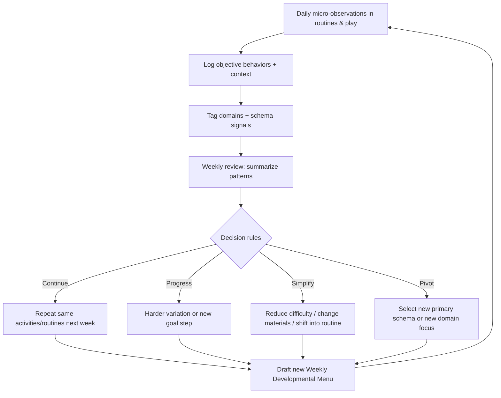

# Evidence-based frameworks for personalized infant development plans at home for ages 10–18 months

## Executive summary

Personalized developmental planning for infants (10–18 months) is most defensible when it combines: (a) close, repeated observation of the individual child’s *strongest recurring action patterns* (often described in early-years literature as “schemas” or “schematic play”), (b) learning-rich caregiving routines structured around *responsive, respectful interaction* (RIE/Educarers) and *independence-supporting practical life* (Montessori), (c) a lightweight assessment system that turns weekly observations into concrete plan updates, and (d) flexible “weekly menus” of options (not rigid schedules) so repetition and choice can drive learning. This aligns with early-childhood guidance emphasizing responsive caregiving and everyday learning opportunities as core drivers of development. citeturn1search7turn2search3turn24search8

Schema-based planning is especially useful at home because schemas are defined as repeated patterns of behavior that children return to across contexts; observing these patterns can inform responsive planning of the environment and experiences. citeturn27view3turn26view3 Education Scotland’s schema guidance explicitly frames schematic play as repeated actions/behaviors in babies and toddlers, notes that repetition supports brain development, and provides concrete schema definitions and activity examples that translate well to household materials. citeturn27view3

RIE and Montessori both treat caregiving routines as primary educational moments, which is consistent with broader evidence: contingent “serve-and-return” interactions support early learning and brain development, and routine-based early intervention models deliberately embed learning into everyday activities for generalization and feasibility. citeturn2search3turn2search2turn2search14turn24search8turn2search0

A practical system for home use is: (1) a weekly Parent Observation Log (brief, objective, domain-tagged entries), (2) one “focus schema” plus 1–2 developmental goals per week, (3) a weekly developmental menu with 3–6 activity options and 1–2 caregiving routines “scripted” for autonomy and language, and (4) clear weekly decision rules (continue / progress / simplify / pivot) supported by milestone references (e.g., CDC). citeturn10search0turn10search2turn10search3turn25view0turn25view1

## Evidence foundations for individualized home plans

Early development is shaped by the child’s day-to-day environment of relationships and repeated interactions. The WHO’s Nurturing Care Framework and related WHO guidance identify responsive caregiving and opportunities for early learning (alongside health, nutrition, safety/security) as core components children need to thrive. citeturn1search7turn1search19turn1search3 The “serve and return” model popularized by Harvard’s Center on the Developing Child describes responsive back-and-forth exchanges as key to shaping brain architecture. citeturn2search3turn2search7 Peer-reviewed reviews likewise link infants’ learning—especially language—to contingent caregiver responses, describing pathways by which timely, meaningful responses facilitate development over time. citeturn2search2turn2search14

Home plans are most sustainable when learning is embedded in routines rather than added “extra curriculum.” This is the premise of routine-based and natural-environment early intervention models: build caregiver capacity by embedding learning opportunities in everyday routines and activities. citeturn2search12turn2search0turn24search8 The Division for Early Childhood (DEC) Recommended Practices (and related “natural environments” principles) emphasize services/supports in natural environments during daily routines and activities to promote participation and learning. citeturn24search0turn24search8turn24search4

Developmentally appropriate practice requires respecting individual variation and avoiding over-scheduling; observation and adaptation are central. NAEYC’s DAP principles highlight that development and learning are individual and context-dependent, and that practice should be responsive to the child. citeturn24search15 This is consistent with schema-based planning (observe → hypothesize what the child is working on → offer matched experiences → observe again). citeturn13view2turn27view3

## Schema play for ages 10–18 months

### What “schemas” mean in practice and why they help planning

In Piagetian terms (as summarized in early-years practice guidance), schemas are cognitive structures used to process and understand information; children modify schemas through experience. citeturn15view0 In early-years schema literature, “schematic play” refers to babies/toddlers engaging in repeated actions or behaviors as they explore how things work. citeturn27view3

Two evidence-relevant points for home planning:

First, schema work has been investigated in early childhood research traditions building on Piaget. Chris Athey directed the Froebel Early Education Project (1970s) and subsequent schema-focused pedagogy influenced practice; Athey’s text reports that a New Zealand teaching program that taught according to children’s schemas found that group “statistically ahead” of other groups (as summarized in the book’s preface). citeturn19view0turn5search0

Second, schema-based observation methods have been extended to children under three: *Understanding Schemas and Young Children: From Birth to Three* describes identifying children’s repeatable patterns of behavior and thought using observations and parent conversations, based on an 18‑month observation period of seven children under age three. citeturn13view2turn20view1 (This is relevant to 10–18 months because it explicitly covers “under three,” though the book is not limited to 10–18 months.)

### How to identify an infant’s current schema at home

A defensible home method is to treat schema identification as a *hypothesis-testing observation cycle*:

1. **Collect short, repeated observations across contexts** (floor play, meals, bath, outdoors) over 3–7 days, because schemas are patterns that recur; single-day fascinations can be misleading. Education Scotland emphasizes repetition and practice as beneficial and notes that some children show more than one schema at a time. citeturn27view3  
2. **Write objective behavioral units** (what happened, not interpretations): “dropped spoon 8 times,” “pushed toy car down hallway repeatedly,” “wrapped doll in cloth,” “turned bottle upside down and looked underneath.”  
3. **Tag each record** with a candidate schema label (trajectory/transporting/rotation/connecting/enveloping/orientation).  
4. **Check for clustering**: children may work with a “cluster” of schemas rather than a single one, so plan for 1 primary + 1 secondary schema when needed. citeturn26view3  
5. **Validate by offering a new object** and seeing whether the same action pattern is applied (e.g., trajectory-focused child drops/throws *many different* objects, not just one preferred toy). This mirrors the schema idea that children assimilate varied experiences into a repeatable pattern. citeturn15view0turn27view3

### Observable indicators and age-appropriate examples for key schemas

The table below uses Education Scotland’s schema descriptions as the anchor (public early-childhood source) and adds home-friendly observable indicators and 10–18 month examples. citeturn27view3

| Schema | What you’ll observe repeatedly | 10–18 month examples in a home setting |
|---|---|---|
| **Trajectory** | Interest in movement paths; repeated throwing/dropping; fascination with how self/objects move. Education Scotland notes trajectory is “one of the earliest” schemas observed in babies and describes throwing food/objects from a highchair and enjoying running water. citeturn27view3 | Drops spoon/food repeatedly from highchair; pushes a ball so it rolls away; crawls quickly back-and-forth along a hallway; watches water run from a faucet (with close adult control). citeturn27view3 |
| **Transporting** | Repeatedly moving resources from place to place; carrying many items using hands/containers. citeturn27view3 | Carries blocks from basket to another room; puts toys into a small bin and brings it to caregiver; loads/unloads a box; pushes a laundry basket or toy stroller with items inside (supervised). citeturn27view3 |
| **Rotational** | Preference for turning taps on/off; winding/unwinding; fascination with spinning body or objects; interest in wheels, lids, spin cycles. citeturn27view3 | Twists jar lids (pre-opened) on/off; turns knobs (with safety); spins a large ring on the floor; watches washer/dryer spin; rotates a stacking ring on a dowel. citeturn27view3 |
| **Enveloping** | Covering/hiding items or self; filling/emptying bags and containers; dressing up. citeturn27view1turn27view3 | Puts toys into a bag, dumps, repeats; hides behind curtain; covers doll with cloth; insists on hats/cloth over head; plays peek‑a‑boo by pulling cloth over face. citeturn27view3 |
| **Connecting** | Joining items together; tying with string; connecting/disconnecting toys (e.g., rail tracks); gluing/sticking pieces. citeturn27view1turn27view3 | Pushes two objects together “making a pair”; connects large interlocking blocks; tries to attach lids; hands caregiver two items to “join.” (Avoid small beads/string for this age; see safety section.) citeturn27view3turn4search1 |
| **Orientation** | Turning objects/self upside down to change viewpoint; looking under table; bending to view world backwards; exploring with tubes/binocular-like objects. citeturn27view1turn27view3 | Peeks under couch/table; looks through a cardboard tube; turns toys upside down to inspect; climbs safely and changes head position (supervised). citeturn27view3 |

### Mapping each identified schema to activity ideas using common household objects

A useful planning procedure is a “3×3 mapping”: for each schema, pick **three core action patterns** the child repeats, create **three activity variants** per pattern using household objects, and then add a *difficulty slider* (simplify vs. extend). This is consistent with schema guidance that children benefit from repeating actions and practicing them in varied ways. citeturn27view3turn26view3

**Trajectory mapping example (household objects)**  
Education Scotland’s trajectory examples include bubbles, scarves/ribbons in wind, throwing soft objects, and water play with funnels. citeturn27view3  
At home, map to:

- *Drop & watch* (vertical): drop large soft balls into a laundry basket; drop ice cubes into a bowl; drop bath toys into the tub (only during supervised bath time).  
- *Roll & chase* (horizontal): roll a ball down a folded-towel “ramp”; roll a cardboard tube gently; push a toy car along tape lines on the floor.  
- *Flow* (continuous trajectory): pour water through a funnel held over a bowl (adult holds funnel at first); squeeze a sponge into a bowl; drip water from a washcloth during bath.

**Rotation mapping example (household objects)**  
Education Scotland describes turning taps, winding/unwinding string, lids, wheels, windmills, watching spin cycles. citeturn27view3  
At home:

- *Twist*: pre-opened jar lids; large plastic containers; screw/unscrew a “spice jar” filled with dry rice (sealed, large lid only).  
- *Spin*: spin a large mixing bowl (empty) gently; spin a large ring; roll a ball in circles around a bowl.  
- *Turn wheels*: wheels on a toy stroller; rolling pin; pushing a wheeled toy in circles.

**Transporting mapping example (household objects)**  
Education Scotland emphasizes repeatedly moving items using containers/baskets/transporters. citeturn27view3  
At home:

- *Fill-carry-dump*: small basket with large soft items; “delivery” from couch to kitchen; dump into a bin.  
- *Load/unload*: move socks from laundry basket into a box; transfer large blocks between bowls.  
- *Push transporter*: push an empty diaper box on the floor (like a cart); push toy stroller with large stuffed animal.

**Enveloping mapping example (household objects)**  
Education Scotland describes covering/hiding items and self, dressing up, filling/emptying bags/containers. citeturn27view3  
At home:

- *Cover/reveal*: hide a toy under a cloth, encourage looking; wrap a toy loosely in a scarf; “peek-a-boo” with a cloth.  
- *In/out containers*: put toys into a tote bag; fill and empty a large bowl; “mail” objects in/out of a shoe box slot (large slot, large objects).  
- *Dress-up lite*: hats, scarves (short supervised periods), socks on hands.

**Connecting mapping example (household objects)**  
Education Scotland describes joining items, tying, connecting/disconnecting, glue/stick. citeturn27view1turn27view3  
At home (10–18 months safe adaptations):

- *Push-fit*: large stacking cups; large interlocking blocks; large ring stacker (supervised).  
- *Attach/detach*: Velcro strips on a big board (adult-made); sticky notes onto a window (adult peels off later); large lids onto containers.  
- *“Together” games*: two spoons together; “match” a lid to its container; place two large blocks together and separate.

**Orientation mapping example (household objects)**  
Education Scotland describes turning self/objects, looking under tables, exploring with cardboard tubes. citeturn27view1turn27view3  
At home:

- *View shifts*: look through a cardboard tube; look through a colander; peek under a chair.  
- *Upside-down*: turn a cup upside down; flip a shoe; rotate a book up/down; “where did it go?” under a blanket edge.  
- *Safe climbing/view*: couch cushion obstacle path for crawling; supervised “up/down” a low step.

### Safety and developmental appropriateness checks for schema activities

Household-object play needs explicit “safety gates” because infants explore with mouths and have variable mobility.

**Choking/small-parts gate**  
Choking is a major risk for children ≤3 years; toys and small objects like coins are common causes. citeturn4search0turn4search3 US safety regulations ban children’s products intended for under-3s if they contain small parts that present choking/aspiration/ingestion hazards (16 C.F.R. part 1501), and CPSC provides guidance on the small-parts rule. citeturn4search1turn4search4 In practice, do not use beads, small rings, or small detachable parts for 10–18 months; even some “schema” resources suggest items (e.g., beads, keys) that can be unsafe without careful size control. citeturn29view0turn4search1

**Water gate**  
Bath and water play must include constant, close supervision. HealthyChildren.org warns that bath drownings often occur during brief lapses, that bath seats can tip, and that children can drown in a few inches of water. citeturn4search5 CDC drowning prevention guidance also emphasizes close, constant supervision around water. citeturn4search2 For schema-linked “flow” play, prefer tiny amounts of water in a shallow bowl while seated and supervised.

**Strings/cords gate**  
Some schema activities involve string (connecting, winding). For 10–18 months, avoid long strings/cords and any unsupervised access to cords due to entanglement/strangulation hazards; if using ribbons briefly for trajectory/orientation, keep them short and directly supervised. (This is a common infant safety principle; when in doubt, omit the string element and use safer “attach/detach” alternatives such as Velcro.) citeturn27view3turn4search3

**Mobility-fit gate**  
Match the activity to the child’s *current* mobility (crawler/cruiser/walker). CDC milestone guidance emphasizes that milestones are age-linked but variable; use them as clues and talk to a clinician if concerned. citeturn10search1turn10search3

## RIE and Montessori caregiving-as-learning protocols for routines

### Why routines are “primary curriculum”

RIE/Educarers explicitly states that caregiving interactions are key relationship and learning moments. RIE’s Educaring practice guidance recommends telling babies what you will do, waiting for a response (“tarry time”), proceeding slowly, and making the infant “part of the process,” linking this to respect and trust. citeturn25view0 Magda Gerber’s diapering guidance frames diapering as a relationship-based opportunity to practice communication, cooperation, and autonomy rather than a distraction-based chore. citeturn25view1

Montessori similarly treats care-of-self and care-of-environment (“Practical Life”) as formative education oriented toward independence. A Montessori quote compilation (with cited source works) includes: practical life as adaptation to environment, education as advancing independence, and the idea that children learn to dress/undress/wash as part of education for independence. citeturn30view0 This aligns with a broader evidence base emphasizing learning through responsive interaction and repeated everyday practice. citeturn2search3turn2search14turn24search8

### Protocol design principles shared by RIE and Montessori

Use these as non-negotiables for routines (diapering, feeding, dressing, bathing):

Caregiving routines should be predictable and respectful: tell the child what will happen, wait for motor/eye-contact cues, and proceed slowly enough that the child can participate. citeturn25view0turn25view1turn40search2 The environment should be prepared so the caregiver is not rushing (supplies within reach; safe, stable setup), because predictability and calm pacing support cooperation and learning. citeturn25view1turn30view0 The interaction should be contingent (“serve-and-return”): respond to the child’s signals and treat them as an active partner. citeturn2search3turn25view0turn40search2

### Step-by-step caregiver scripts and setups

The scripts below are intentionally concrete; they are designed for 10–18 months (often mobile, sometimes resistant) and can be shortened.

#### Diapering as learning

**Environment setup**  
Prepare everything before you pick the child up (diaper, wipes, cream, change of clothes). This reduces rushed movements and supports predictable, calm caregiving. citeturn25view1turn25view0

**RIE-style script with autonomy prompts**  
RIE guidance: tell before you do; wait; look for response; proceed slowly and involve the child. citeturn25view0turn25view1

1. **Approach and name the transition**: “I’m going to change your diaper now.” (Move into the child’s line of sight.) citeturn25view0  
2. **Wait for a response (“tarry time”)**: look for eye contact, a pause, a shift of attention, arms up, or body stilling. citeturn25view0turn25view1  
3. **Invite participation**: “Can you help me by lifting your bottom / giving me your leg?” (For 10–18 months, leg-out and “bottom up” often become realistic.) citeturn25view0turn25view1  
4. **Narrate sequentially** (simple sentences): “First I’m opening the diaper. Now I’m going to wipe.” citeturn25view0  
5. **Offer micro-choices** (Montessori-compatible autonomy): “Do you want the wipes in your left hand or right hand?” (Only if safe; otherwise: “You can hold the clean diaper.”) Montessori independence framing supports initiating children into activities they can perform themselves. citeturn30view0  
6. **Close with completion ritual**: “All done. I’m picking you up.” (Wait again briefly.) citeturn25view0

**Embedded sensorimotor learning (schema-aware)**  
If trajectory schema is strong, incorporate a safe “drop into bin” moment: child drops the old diaper (bagged) into a trash bin with caregiver support. If connecting schema is strong, invite child to help press diaper tabs (hand-over-hand only if needed). These embed repeated action patterns into a meaningful routine, consistent with schema theory’s emphasis on repetition and meaningful assimilation. citeturn27view3turn25view1

#### Feeding as learning

**Environment setup**  
Seat the child securely; minimize distractions (no screens) to keep attention available for interaction and self-feeding practice. Responsive interaction is a consistent predictor of language learning, and mealtimes are repeated daily contexts for such interaction. citeturn2search2turn2search14turn24search8

**Protocol**  
1. **Preview**: “It’s time to eat. I’m going to put your plate here.” citeturn25view0  
2. **Offer self-feeding affordances**: preloaded spoon, finger foods sized to reduce choking risk (follow pediatric choking prevention guidance). citeturn4search3turn4search0  
3. **Narrate with “serve-and-return”**: mirror the child’s focus: “You’re holding the banana. You took a bite.” Then pause. citeturn2search3turn25view0  
4. **Choice and autonomy**: “Water or milk?” (two options). Montessori emphasizes assisting independence and initiating children into activities they can perform. citeturn30view0  
5. **Clean-up together**: child transports cup to sink area (transporting schema), drops napkin into bin (trajectory), or wipes tray with a cloth (practical life approximation). citeturn27view3turn30view0

#### Dressing as learning

**Environment setup**  
Lay out 2 clothing options only (reduce overload), keep the child seated or supported to match mobility.

**Protocol**  
1. **Announce and wait**: “I’m going to help you put on your shirt.” Pause for readiness. citeturn25view0  
2. **Body-part language + action**: “Arm in. Now other arm.” (Pause after each cue.) citeturn25view0  
3. **Participation prompts**: “Can you push your arm through?” When the child offers the “wrong” limb, treat it playfully (Gerber suggests following the child’s initiative and staying calm). citeturn25view1  
4. **Autonomy micro-step**: child pulls down socks, pushes arms through sleeves, or places hat on head. Montessori frames dressing/undressing as part of education for independence. citeturn30view0

#### Bathing as learning

**Safety baseline**  
Bath safety is non-negotiable: keep the child within arm’s reach; if you must leave, bring the baby with you. HealthyChildren.org notes bath seats can tip and drowning can occur in a few inches of water. citeturn4search5turn4search2

**Environment setup**  
Everything within reach: towel, soap, washcloth, cup for rinsing.

**Protocol**  
1. **Preview and consent-like respect**: “I’m going to put you in the bath now.” Wait for cues. citeturn25view0turn40search2  
2. **Sensorimotor + schema embedding**: provide a small cup for pour/fill (transforming), floating toys for dropping/splash trajectory, washcloth for enveloping (briefly cover and reveal toy), always under supervision. citeturn27view3turn4search5  
3. **Language prompts**: label sensations (“warm,” “wet”), body parts, and sequences (“first wash hands, then rinse”). RIE emphasizes simple direct sentences and waiting for response. citeturn25view0  
4. **Close routine**: “All done. I’m lifting you out.” Pause. citeturn25view0

## Assessment systems for weekly planning

### Weekly Parent Observation Log template

A weekly log should capture *specific, observable behaviors* across domains relevant to 10–18 months, plus schema signals and routine participation. Milestones can be anchored to official developmental surveillance resources like CDC’s milestone lists (9, 15, 18 months). citeturn10search0turn10search2turn10search3

**Template design goals**

The log is not a diagnostic tool; it is (a) a structured memory aid, (b) a way to detect change over time, and (c) a trigger for plan updates and—when appropriate—discussion with a pediatric clinician (CDC encourages discussing concerns and any loss of skills). citeturn10search1turn10search3

**Recommended fields**

Use one line per observation (“micro-entry”), 1–5 minutes/day:

- Context (routine/play/place)  
- Domain (gross motor, fine motor, language/communication, joint attention, social engagement, cognition/problem solving, object permanence)  
- Observable behavior and exact prompt (if any)  
- Frequency count (rough is fine)  
- Status code: 0 = not yet observed, 1 = emerging/inconsistent, 2 = consistent across at least 2 contexts or 3 days

This structure matches how parent-report and observation-based screeners work (e.g., SWYC is designed as a brief parent/caregiver report, used as a first-level screener, not diagnostic). citeturn23view0turn22view2

**Downloadable editable log template (CSV)**  
[Download the Weekly Parent Observation Log template](sandbox:/mnt/data/Weekly_Parent_Observation_Log_Template.csv)

### Decision rules for updating the next week’s personalized plan

Use explicit “if/then” rules so planning changes are consistent and not mood-driven:

**Continue (repeat)** if:  
A goal is still in “emerging” status (mostly 1s), the child is engaged, and participation is increasing. Repetition is explicitly recommended in Montessori-at-home planning guidance and is foundational to schema learning. citeturn37view0turn27view3

**Progress (harder variation)** if:  
A goal is “consistent” (2) across multiple days/contexts, and the child shows low frustration. Example progression: from dropping large soft balls into a basket → dropping smaller (but still safe, non-choking) items into a wide-mouth container; from cruising along couch → cruising while carrying a soft object (transporting + gross motor). citeturn27view3turn10search2

**Simplify or change materials** if:  
The child avoids the activity, shows repeated distress, or cannot access the affordance (e.g., connecting tasks too hard). Modify by increasing size, stabilizing objects, shortening duration, or moving the activity into an easier routine context (embedded learning). citeturn24search8turn27view3

**Pivot the plan (new schema focus)** if:  
A new action pattern dominates across contexts for ≥3 days (e.g., sudden intense rotation: turning lids, spinning). Education Scotland notes children can display more than one schema; a pivot is appropriate when a new schema becomes predominant. citeturn27view3

### Examples of dynamic weekly plan adjustments

These are illustrative “plan updates” showing how the rules work:

**Example adjustment A (Trajectory → Trajectory+Language)**  
Week 1: Child repeatedly drops spoon/food (trajectory). Menu includes safe “drop into bucket” + ramps.  
Observation: child begins pausing and looking at caregiver before dropping (joint attention).  
Week 2 adjustment: keep trajectory activities but add “pause + label” script: “Ready… drop!” and wait for eye contact before release (serve-and-return). citeturn27view3turn2search3turn25view0

**Example adjustment B (Connecting too hard → Pre-connecting)**  
Week 1: Goal is stacking/clicking large blocks; child mouths blocks and throws them.  
Decision: simplify.  
Week 2: move to “match lid to container” and “push two blocks together” with adult stabilizing one object; keep pieces too large to be choking hazards. citeturn27view3turn4search1turn4search3

**Example adjustment C (Routine resistance → routine-as-play)**  
Week 1: diapering struggles; caregiver rushed.  
Week 2: implement RIE diapering steps—warning, wait, cooperation prompts—and add one schema-aligned job (child drops wiped diaper into bin). citeturn25view0turn25view1turn27view3

### Comparison of assessment instruments or templates

The table below compares commonly used instruments/templates that can inform a home planning system. “Best” depends on whether you need a free screener, language depth, or professional evaluation.

| Instrument/template | Age range coverage | Domains | Format & effort | Cost/access | Best use in a home planning system |
|---|---|---|---|---|---|
| **CDC Milestone Checklists / Milestone Tracker** | Milestone pages include 9, 15, 18 months; milestones defined as skills most children (≥75%) can do by that age. citeturn10search1turn10search0turn10search2turn10search3 | Broad surveillance: social, language, cognitive, movement | Checklist/app; low effort | Free (CDC) citeturn10search1 | Anchor “what to look for” and “when to discuss concerns”; not a scored developmental test |
| **SWYC (Survey of Well-being of Young Children)** | 1–66 months; designed for parents/caregivers; first-level screener; ~10 minutes. citeturn23view0turn22view2 | Milestones; behavioral/emotional; autism risk; family stress (varies by form) citeturn13view4 | Parent-report form + scoring thresholds | Freely available, but copyrighted and cannot be modified without permission (per manual). citeturn22view0turn22view2 | Good periodic screener (monthly/quarterly); use results to choose weekly focus, but keep a separate editable weekly log |
| **ASQ‑3 (Ages & Stages Questionnaires, Third Edition)** | Multiple interval forms; measures 5 domains (communication, gross motor, fine motor, problem solving, personal-social). citeturn3search4turn3search0 | Broad developmental screening | Parent-completed; structured scoring | Typically purchased/licensed (commercial). citeturn3search4 | Strong structured baseline every 2–3 months; helps pick priority goals |
| **MacArthur‑Bates CDI (Words & Gestures)** | Words & Gestures form targets ~8–18 months. citeturn3search6turn3search2 | Early language: comprehension, production, gestures | Parent-report; moderate effort | Often used in research/clinical contexts; forms vary by access | Deep dive on language/gesture changes; use alongside weekly log if language is key concern |
| **Bayley‑4 (Bayley Scales of Infant & Toddler Development)** | 16 days–42 months; comprehensive standardized assessment. citeturn3search3turn3search15 | Cognitive, language, motor (and optional scales) | Professional administration; higher time | Expensive; qualified administrators (commercial). citeturn3search3 | Best when a professional evaluation is needed; not a weekly home tool |

**Recommended adaptable template (home use)**  
Use a **two-layer system**: a *modifiable Weekly Parent Observation Log* (your day-to-day engine) plus a **periodic screener** (CDC milestones for free surveillance; SWYC for free scored screening; or ASQ‑3 if you have access). This approach fits the principle that monitoring is an ongoing process and that first-level screeners are followed by further conversation/investigation when concerns arise. citeturn22view2turn10search1turn24search8

### Weekly observation-to-plan update cycle



## Weekly developmental menus and templates

### What a “Weekly Developmental Menu” is

A weekly menu is a *set of options* for the week (goals + choices + materials + prompts + suggested time windows), not a time-block schedule. This supports repetition (children repeat what they are working on) and lets caregivers select what fits the day. Education Scotland’s schema guidance and Montessori planning guidance both emphasize repeating and practicing actions rather than constant novelty. citeturn27view3turn37view0

### External templates/examples found via search

These are not all infant-specific “development menus,” but they are reusable structures/examples you can adapt:

- **Education Scotland: “Schemas—Learning through play” (PDF)** provides schema descriptions plus activity ideas for trajectory, transporting, rotational, enveloping, connecting, and orientation—effectively a schema-based activity menu. citeturn13view3turn27view3  
- **Vroom printable tip sheets** provide “brain building” activity prompts tied to everyday moments (not rigid schedules), designed to remind caregivers that learning opportunities are embedded in what you already do. citeturn6search3  
- **Montessori Academy (Australia): Sample Home Lesson Plan (Infants 0–2)** shows a weekly grid layout with categories and space for notes—useful as a format example (though it is more schedule-like than a flexible menu). citeturn38view0turn39view0  
- **Activity matrix planning (special education / early intervention)** templates show how to embed goals into routines across a week (useful structure even for typically developing children). For example, an “Activity Matrix Tip Sheet” describes matrices as tools to plan instruction throughout routines and transitions. citeturn8search1turn8search5  
- **CIAP (Child Interest and Activity Plan)** materials exemplify planning “between visits” around child interests and everyday activities, although some materials are rights-restricted (link rather than copy). citeturn9search1turn9search11turn32search12

### Editable templates you can use immediately

**Downloadable PDF mockup (1 page)**  
[Download the Weekly Developmental Menu template (PDF)](sandbox:/mnt/data/Weekly_Developmental_Menu_Template.pdf)

**Downloadable editable table template (CSV)**  
[Download the Weekly Developmental Menu table template (CSV)](sandbox:/mnt/data/Weekly_Developmental_Menu_Table_Template.csv)

**Copy/paste text template (editable)**

**Weekly Developmental Menu (10–18 months) — text template**
- Child / week:  
- Primary schema(s):  
- Secondary schema(s):  
- Top 2 goals (observable):  
  - Goal 1:  
  - Goal 2:  
- Caregiving-as-learning routine focus (choose 1–2): diapering / feeding / dressing / bathing  
- Caregiver script cue (what I will say, what I will wait for):  
- Activity options for the week (pick 3–6; repeat favorites):  
  - Option A: (goal link) / materials / prompt / time window  
  - Option B: …  
- Safety check (quick): choking hazards removed? water supervised? strings/cords controlled?  
- What I’m watching for (success criteria):  
- End-of-week reflection (what worked / what to change):  
- Next-week decision: continue / progress / simplify / pivot  

### Sample filled Weekly Developmental Menus for two hypothetical infants

The two examples below are **hypothetical** and include explicit assumptions (because no child-specific data was provided). They demonstrate the framework, not “typical” prescriptions.

#### Hypothetical infant profile A

Assumptions: 10 months old; crawling; pulls to stand; uses both hands; babbles; shows strong dropping/throwing (trajectory) and some container interest; enjoys peek‑a‑boo (early enveloping signal). These assumptions are consistent with common 9–12 month developmental patterns in surveillance resources (e.g., object permanence behaviors like looking for hidden objects are described around this period) but individual variation is expected. citeturn10search0turn27view3

**Weekly Developmental Menu — 10 months**
- Primary schema: **Trajectory** citeturn27view3  
- Secondary schema: **Enveloping (emerging)** citeturn27view3  
- Goal 1 (gross motor + problem solving): “Across the week, crawls to retrieve a rolled ball or dropped toy in at least 2 rooms (2+ separate days).”  
- Goal 2 (joint attention + early communication): “Looks at caregiver before releasing an object (drop/throw) at least 3 times/day (even briefly).” (Serve-and-return shaped.) citeturn2search3turn2search2  

Caregiving-as-learning routine focus: **Diapering** (RIE script) citeturn25view0turn25view1  
- Script cue: “I’m going to change your diaper. (pause) Can you lift your bottom? (pause) Thank you.”

Activity options (pick 4–6 across the week; repeat favorites):
- **Drop into basket (trajectory)**: child drops 3–5 large soft balls into a laundry basket; caregiver says “Ready… drop,” waits for eye contact, then smiles. (2–5 min) citeturn27view3turn2search3  
- **Ramp roll (trajectory + tracking)**: towel ramp from couch cushion to floor; roll ball slowly; child crawls to chase. (3–8 min) citeturn27view3  
- **Faucet watch + cup drip (trajectory/flow)**: at sink with child supported; adult controls water; allow child to watch flow; drip water from washcloth into bowl. (1–3 min; strict supervision). citeturn27view3turn4search2  
- **Peek-a-boo cloth (enveloping + object permanence)**: hide toy under cloth edge; wait; let child pull cloth. (2–5 min) citeturn27view3turn10search0  
- **Container in/out (enveloping/transporting bridge)**: put large blocks into a big bowl; dump; repeat. (3–8 min) citeturn27view3turn4search1  

Safety check:
- No small parts (CPSC small-parts rule guidance). citeturn4search1turn4search3  
- Water within arm’s reach; never leave bath/sink. citeturn4search5turn4search2  

Success signals to log:
- Increased pause/eye contact before drop; fewer distressed protests during diapering when waiting is used. citeturn25view0turn25view1

#### Hypothetical infant profile B

Assumptions: 17 months old; walking well; beginning to combine words; strong interest in turning lids/wheels (rotation) and joining objects (connecting); enjoys looking under furniture (orientation). These assumptions are broadly consistent with 15–18 month milestone surveillance themes (e.g., increased tool use, object exploration), but individual variation is expected. citeturn10search2turn10search3turn27view3

**Weekly Developmental Menu — 17 months**
- Primary schema: **Rotational** citeturn27view3  
- Secondary schema: **Connecting** (emerging) citeturn27view3  
- Goal 1 (fine motor + problem solving): “Opens and closes a large lid/container with minimal assistance in 2 different contexts.” citeturn27view3  
- Goal 2 (language + social engagement): “Uses 1–2 words/gestures to request help or label action during play (‘open,’ ‘more,’ ‘turn’) at least once per day.” (Contingent response supports language.) citeturn2search2turn2search14  

Caregiving-as-learning routine focus: **Dressing**  
- Montessori independence cue: child pulls socks off/on with assistance; caregiver slows, narrates, and lets child initiate. Montessori sources emphasize dressing/undressing as part of education for independence. citeturn30view0  
- RIE-style pacing: announce, wait, and proceed slowly. citeturn25view0turn40search2  

Activity options:
- **Lid station (rotation)**: 3 large containers with oversized lids; child tries open/close; caregiver narrates “twist,” pauses, waits for child attempt; offer help only after attempt. citeturn27view3turn25view0  
- **Wheel watch (rotation)**: spin a large bowl; roll a toy with wheels; watch washer spin cycle (brief, safe). citeturn27view3  
- **Connect & separate (connecting)**: large interlocking blocks; goal is “push together → pull apart.” Avoid small sets. citeturn27view3turn4search1  
- **Orientation peek hunt**: “Where did it go?” under a blanket edge; child looks under chair; optional cardboard tube “look.” citeturn27view3  
- **Transport + rotate combo**: place 3 safe objects into a container, carry to a new place, dump, then twist lid back on (transporting + rotation integration). citeturn27view3  

Safety check:
- Choking prevention: keep lids and parts too large to fit in small-parts testers; supervise. citeturn4search1turn4search0turn4search3  

Success signals:
- Fewer “grab-only” interactions; more attempts before requesting help; more spontaneous labels during actions (language embedded in action). citeturn2search2turn25view0

### Link list to referenced templates and diagrams

(Placed in code blocks so you can copy/paste; all are also supported by the citations above.)

```text
Education Scotland – Schemas: Learning through play (PDF)
https://education.gov.scot/media/chjjekf0/nih058-parentzone-booklet.pdf

Vroom – printable “Vroom Tip Sheets” (examples by age)
https://www.vroom.org/vroom-materials?tab=Vroom+Tip+Sheets

Montessori Academy (AU) – Sample Lesson Plans (PDF includes “Infants 0–2” weekly grid)
https://montessoriacademy.com.au/wp-content/uploads/2024/07/Sample-Lesson-Plans.pdf

SWYC User’s Manual (PDF)
https://www.tuftsmedicine.org/sites/default/files/2023-10/SWYC%20Manual%20v101%20Web%20Format%2033016.pdf

Magda Gerber Legacy – “Off Again, On Again” (diapering as relationship/learning)
https://magdagerber.org/magdas-writings/off-again-on-again/

RIE – “Tell the Baby What You are Going to Do” (Educaring practice steps)
https://rie.org/rie-practice-tell-the-baby-what-you-are-going-to-do-to/
```

